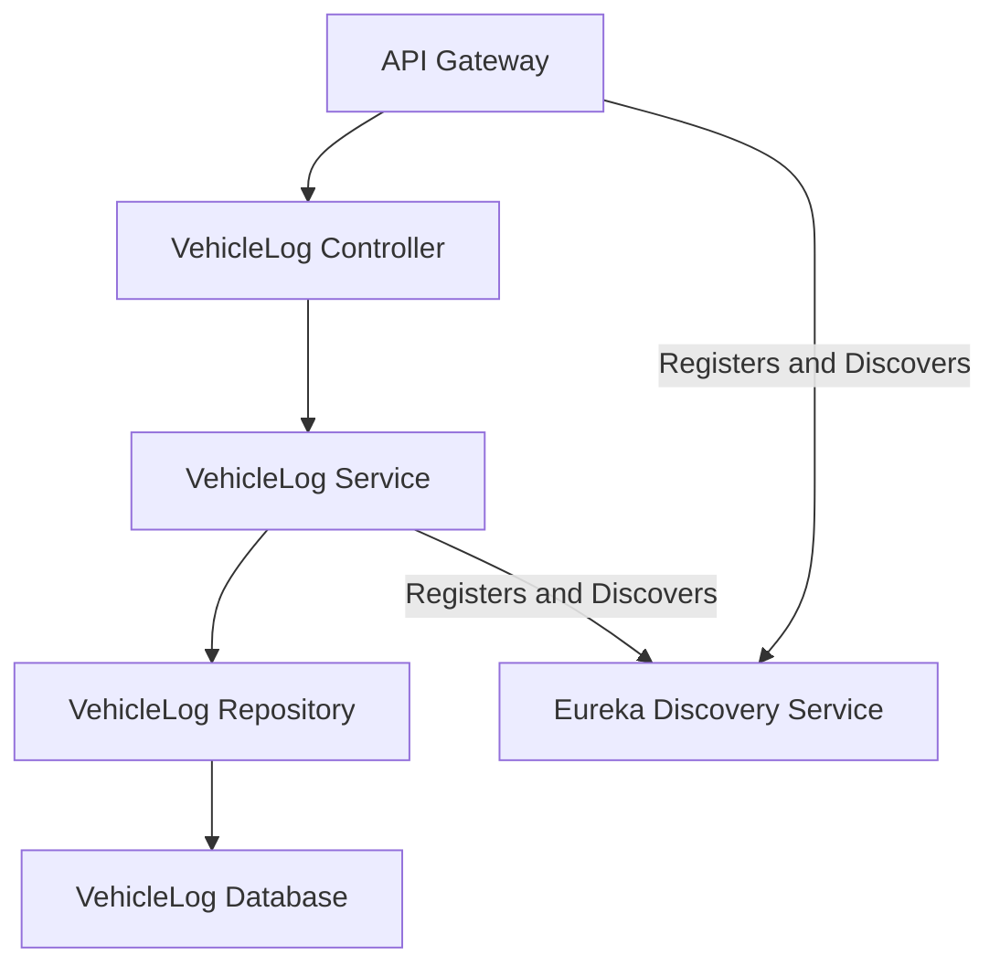
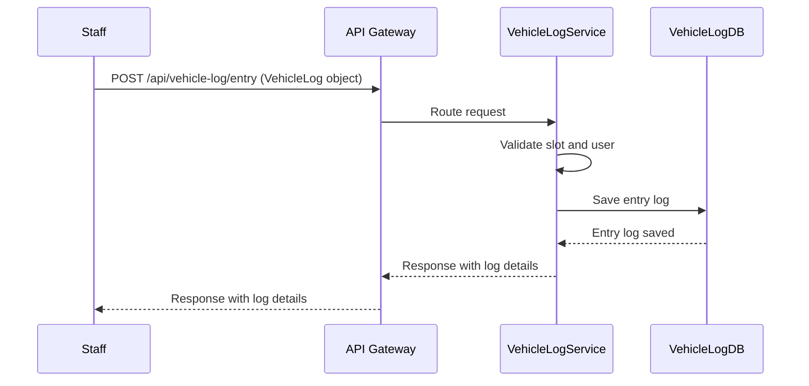

# VehicleLog-Service Module Low-Level Documentation

This document provides a low-level overview of the `VehicleLog-Service` module, a microservice within the Parking Management System (PMS) responsible for managing vehicle entry and exit operations.

---

## 1. Project Overview

The `VehicleLog-Service` module is a core component of the Parking Management System (PMS), dedicated to tracking vehicle movements. It handles operations such as logging vehicle entry and exit, updating parking slot occupancy, and calculating parking duration for billing purposes.

### Features

- **Log vehicle entry**
  - Records the entry time of a vehicle into a parking slot.
  - Validates slot availability and user association.
  - Updates the slot status to occupied.

- **Log vehicle exit**
  - Records the exit time of a vehicle from a parking slot.
  - Calculates the total duration of parking.
  - Updates the slot status to available.

- **Retrieve vehicle log by ID**
  - Enables fetching specific vehicle log details using a unique log ID.
  - Returns entry time, exit time, vehicle number, slot ID, and user ID.

- **Retrieve all vehicle logs**
  - Provides functionality to fetch all vehicle logs in the system.
  - Supports pagination and filtering for efficient data handling.
  - Returns a list of logs with basic details.

---

## 2. Architecture

### 2.1 High-Level Architecture

The `VehicleLog-Service` module is built using the **Spring Boot** framework and adheres to a **layered architecture**. It communicates with other services via **REST APIs** and utilizes **H2** as its database for local development purposes.

### 2.2 Layered Architecture




### 2.3 Technologies Used

- **Framework:** Spring Boot  
- **Database:** H2 (local development)  
- **Language:** Java  
- **Build Tool:** Maven  

---

## 3. Database Design

### 3.1 Database Tables

The `VehicleLog-Service` module utilizes the following table:

#### VehicleLog Table

| Column Name     | Data Type | Description                          |
|-----------------|-----------|--------------------------------------|
| `logId`         | Long      | Primary key (auto-generated)         |
| `vehicleNumber` | String    | Vehicle registration number          |
| `entryTime`     | Timestamp | Time of vehicle entry                |
| `exitTime`      | Timestamp | Time of vehicle exit                 |
| `slotId`        | String    | Foreign key to ParkingSlot           |
| `userId`        | String    | Foreign key to User                  |

---

## 4. API Endpoints

### 4.1 Vehicle Log Management

| Endpoint                        | Method | Description           | Request Body/Params     |
|--------------------------------|--------|-----------------------|--------------------------|
| `/api/vehicle-log/entry`       | POST   | Log vehicle entry     | VehicleLog object        |
| `/api/vehicle-log/exit/{logId}`| POST   | Log vehicle exit      | `logId` (Path Variable)  |
| `/api/vehicle-log`             | GET    | Retrieve all logs     | None                     |

### 4.2 Sequence Diagram




### 4.3 Swagger Documentation

Detailed API documentation can be found via Swagger UI, typically available at: /swagger-ui.html when 
the service is running.

---

## 5. Error Handling

The module leverages Spring Boot's exception handling mechanisms to return appropriate HTTP status codes for errors, ensuring clear communication of issues to client applications.

### Common Error Codes

| Error Code | Description           |
|------------|-----------------------|
| `400`      | Bad Request           |
| `404`      | Resource Not Found    |
| `500`      | Internal Server Error |

---

## 6. Dependencies

### Key Dependencies

- Spring Boot Starter Web: For building REST APIs  
- Spring Boot Starter Data JPA: For database interactions  
- H2 Database: In-memory database for local development  
- Lombok: For reducing boilerplate code  
- JUnit & Mockito: For unit testing  

---

## 7. Deployment

The `VehicleLog-Service` module is configured to run on **port `8020`**. It uses **Maven** for building and packaging the application. Database configurations are defined within the `application.properties` file.

### Key Configuration

```properties
spring.application.name=vehiclelog-service
server.port=8020
spring.datasource.url=jdbc:h2:file:./data/vehicleLogDB;DB_CLOSE_DELAY=-1;DB_CLOSE_ON_EXIT=FALSE
spring.datasource.driver-class-name=org.h2.Driver
spring.datasource.username=sa
spring.datasource.password=
spring.jpa.hibernate.ddl-auto=update
